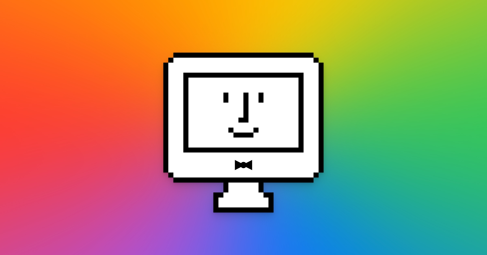
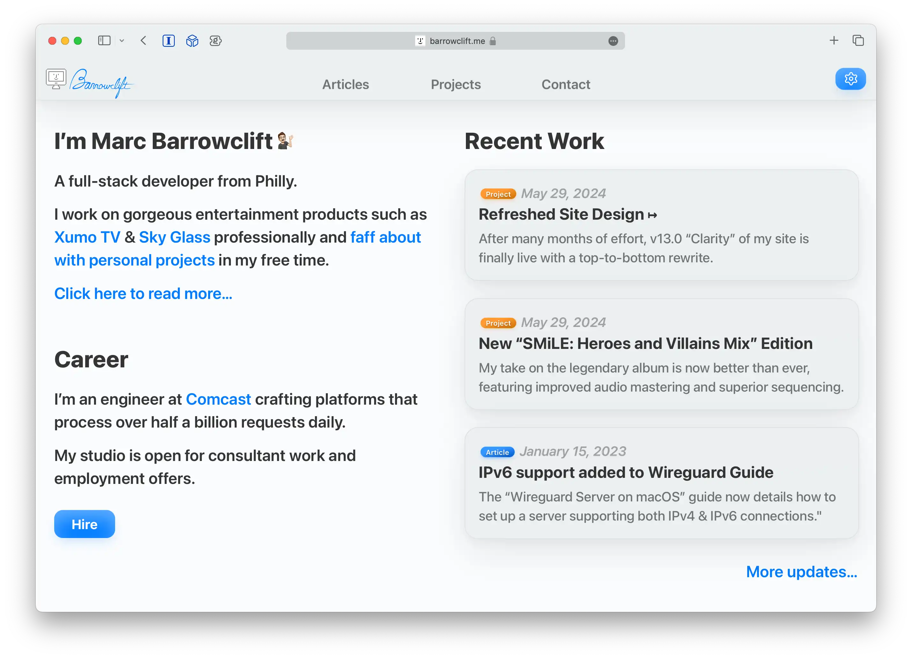
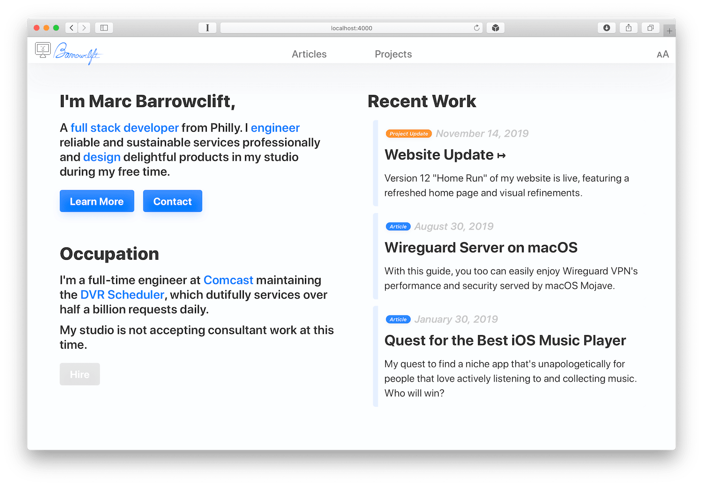
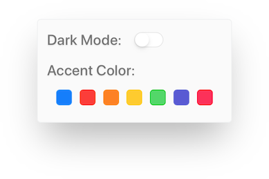

Welcome! Please feel free to stop by and celebrate the humanity in computing with me.

--------

# Notable Versions

## v13.0 "Clarity"

The site was a complete mess. The backend was full of spaghetti CSS and the frontend was rife with inconsistent colors, margins, and more. What started as just minor changes to the ["SMiLE: Heroes and Villains Mix"](https://barrowclift.me/projects/music/smile-heroes-and-villains-mix/) soon ballooned to a site-wide refactoring and design refresh.

Regarding the markup, I'm *finally* using CSS variables to not only dramatically reduce style clone and "magic" numbers but to empower me to realistically apply a site-wide *consistent* design voice. While doing so I applied a philosophical change in how the styles are ordered; instead of scattering components all over the place in an effort to make applying similar styles to numerous components easier (again, I wasn't using CSS variables, before), I could finally keep component styles *tightly* close together, dramatically increasing readability and maintainability.

On the design front, at first glance it appears not much has changed, but look deeper: every single component, every single color, every single margin, has been excruciatingly reassessed. Here's my best stab at the design change log, in no particular order.

* The Articles page has been entirely rewritten to feature articles as "cards" with the promo image, title, and other metadata to make quickly scanning through articles page to find one of interest more pleasing and quick.
* Article media *finally* employs a consistent style regarding their margins and behavior.
* Code blocks now use light mode syntax colors when the page is in light mode, and both light & dark syntax themes have been refreshed to take cues from the site's accent colors.
* "Elevated" components like cards, popups, toasts, and more now all employ a consistent style.
* The accent colors have been fully refreshed with a proper purple color and a more endearing shade of pink.
* When possible, the p3 variants of the accent colors are used to take full advantage of modern displays.
* The sloppy rainbow "splash" backdrop that appeared on the Happy iMac on hover is gone, now fully realized with a lovely shifting gradient wheel.
* Frustratingly, the old site's `articles/` page assigned individual articles a `posts/` path, but now articles finally roll up to the `articles/` path, as expected.
* Project & article updates are now maintained separately from articles, and can now be their own small "update" pages, too.
* Refined print stylesheet. You like reading on paper? Try printing any of my articles, they'll look great!
* Many, many more refinements like these throughout.

## v12.0 "Home Run"

Up to this point, my website didn't really have a tranditional "home" page—the landing page for the site was the Articles page. With "Home Run", the site now has a proper home page with an "elevator pitch" for who I am, my current occupation, and my most recent works (articles, projects, etc.).

## v11.0 "Foreigner"

With the introduction of macOS Mojave, users can now choose a preferred accent color for the system. Jumping from just the "Blue" and "Graphite" colors we've known for the past decade, users can now change buttons, links, and more to be their favorite color.

Much like macOS, my personal website has also "supported" custom accent colors, but never exposed them to the user in any meaningful way. Now, with the new accessibility settings in 11.0, you can customize the site to match your preferred system accent color, so the site will always gracefully match your personality and style.

## v10.0: "Unity"

Until now, [Marcdown](https://barrowclift.me/marcdown) and [barrowclift.me](https://barrowclift.me) styles were designed and maintained independently, in parallel. This was a choice made mostly due to these historical reasons:

1. At the time, I still wasn't happy with barrowclift.me's style, so Marcdown became my playground to experiment with the design without feeling the need to commit to them. It simply wasn't feasible to keep [barrowclift.me](https://barrowclift.me) in sync with Marcdown due to the sheer rate of changes.
2. [barrowclift.me](https://barrowclift.me)’s stylesheet was created when I was first learning CSS and only just beginning to flex my design muscles, so there was a tremendous amount of legacy baggage I didn't want to or have to carry over to Marcdown's stylesheet. In this respect, keeping them separate was an advantage.

That time has now passed. [barrowclift.me](https://barrowclift.me)’s legacy code has been all but swept away as the CSS has been gradually refined over the years. The time was right, both barrowclift.me and Marcdown were finally beginning to converge towards a similar style. With the differences between them falling away and the benefits of keeping them separate dwindling, it's time to fuse them together to create one, final CSS and Javascript heart which will serve as the foundation for all future changes made to both Marcdown and barrowclift.me from this point on—`core.css` and `core.js`.

It's time to bring order to the chaos. It's time for Unity.
