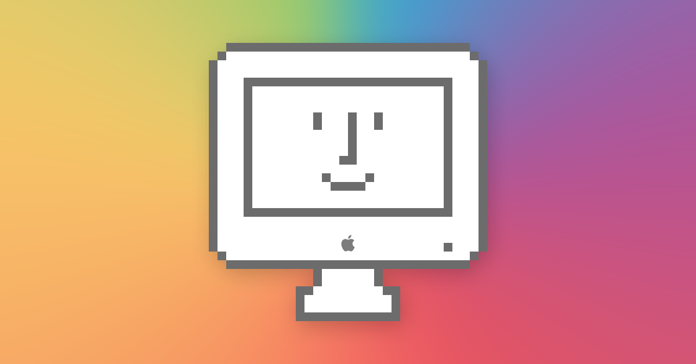
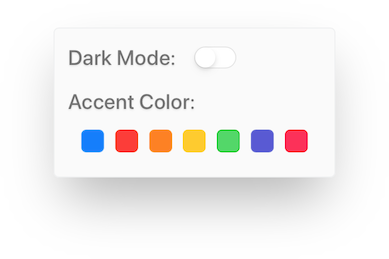

Welcome! Please feel free to stop by, take a load off your feet, brew some tea, and [celebrate the humanity in computing](https://barrowclift.me) with me.

--------

# 11.0 - "Foreigner"

With the introduction of macOS Mojave, users can now choose the accent color for the system. Jumping from just the "Blue" and "Graphite" colors we've known for the past decade, users can now change buttons, links, and more to be their favorite color.

Much like macOS, my personal website has also "supported" custom accent colors, but never exposed them to the user in any meaningful way. Now, with the new accessibility settings in 11.0, you can customize the site to match your preferred system accent color, so the site will always gracefully match your personality and style.

# 10.0 - "Unity"

Until now, [Marcdown](https://barrowclift.me/marcdown) and [barrowclift.me](https://barrowclift.me) styles were designed and maintained independently, in parallel. This was a choice made mostly due to these historical reasons:

1. At the time, I still wasn't happy with barrowclift.me's style, so Marcdown became my playground to experiment with the design without feeling the need to commit to them. It simply wasn't feasible to keep [barrowclift.me](https://barrowclift.me) in sync with Marcdown due to the near constant changes most of its life.
2. [barrowclift.me](https://barrowclift.me)’s stylesheet was created when I was first learning CSS and only just beginning to flex my design muscles, so there was a tremendous amount of legacy baggage I didn't want to / didn't have to carry over to Marcdown's stylesheet. In this respect, keeping them separate was an advantage.

That time has now passed. [barrowclift.me](https://barrowclift.me)’s legacy code has been all but swept away as the CSS has been gradually refined over the years. Additionally, both [barrowclift.me](https://barrowclift.me) were beginning to converge together towards a similar style for some time now. With the differences between them falling away and the benefits of keeping them separate dwindling, it's time to fuse them together to create one, final CSS and Javascript heart which will serve as the foundation for all future typographic/design changes made to Marcdown and barrowclift.me from this point on&mdash;`core.css` and `core.js`.

It's time to bring order to the chaos. It's time for Unity.